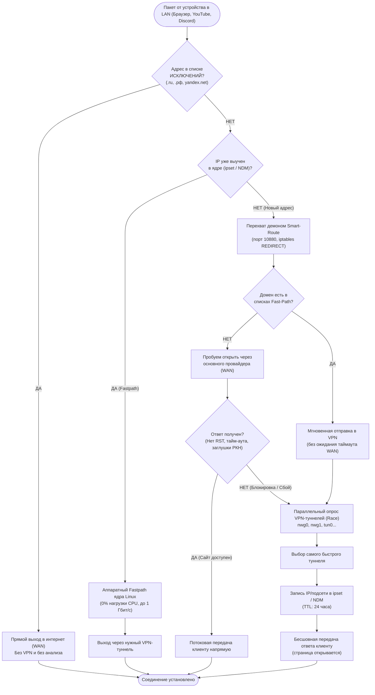
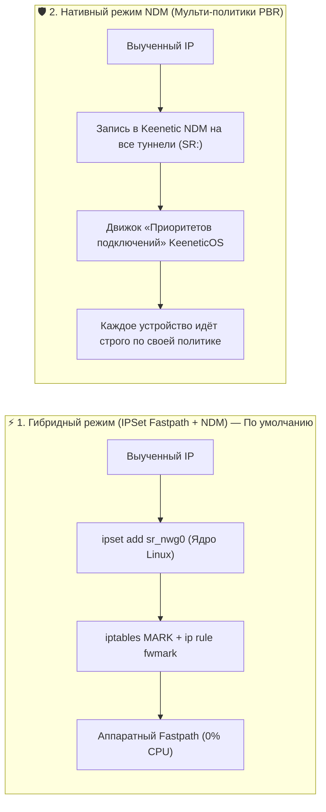
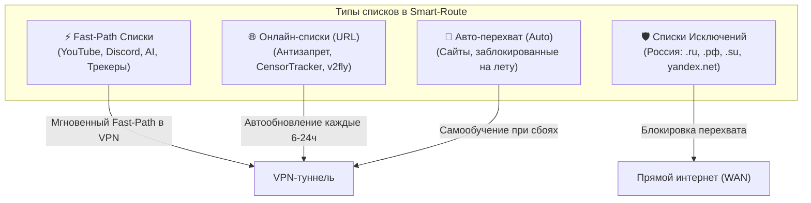

# Руководство пользователя и Архитектура Smart-Route

**Smart-Route** — это высокопроизводительный, легковесный системный сервис со встроенным веб-интерфейсом для роутеров **Keenetic** с установленной средой **Entware**.

---

## 🎯 1. В чём главная идея Smart-Route?

Обычные VPN-клиенты либо пускают **весь** трафик через VPN (из-за чего российские сайты и банки не открываются или тормозят), либо требуют вручную вести огромные списки маршрутов.

**Smart-Route решает эту проблему автоматически и аппаратно:**
1. **Бесшовный перехват (Failover)**: если сайт не заблокирован, он открывается напрямую на максимальной скорости вашего провайдера. Если же сайт заблокирован (TCP RST, таймаут, сброс от ТСПУ/DPI), Smart-Route **на лету подхватывает соединение**, находит рабочий VPN-туннель и передаёт данные клиенту **без обрыва вкладки в браузере**.
2. **Аппаратная разгрузка ядра (Kernel Offload via IPSet / NDM)**: после первого успешного подключения адрес мгновенно запоминается в ядре Linux. Все последующие гигабайты и 4K-видео передаются **аппаратным чипом роутера на скорости до 1 Гбит/с при 0% нагрузки на процессор**.

---

## 🏛️ 2. Блок-схема: Жизненный цикл соединения

Ниже показано, что происходит с каждым сетевым пакетом от вашего смартфона, ПК или Smart TV:



---

## ⚙️ 3. Режимы маршрутизации (Routing Engines)

В разделе **«Настройки»** панели управления доступно переключение логики работы:



| Параметр | ⚡ Гибридный режим (IPSet Fastpath) | 🛡️ Нативный режим Keenetic NDM |
| :--- | :--- | :--- |
| **Скорость и нагрузка** | **Максимальная** (аппаратный оффлоад, 0% CPU) | Стандартная скорость маршрутизации KeeneticOS |
| **Вместимость** | **100 000+ IP и подсетей** без потери скорости | До десятков тысяч маршрутов |
| **Устаревание (TTL)** | **Автоматическое (24ч)** — ядро само очищает неиспользуемые IP | Очищается фоновым демоном SmartRoute |
| **Поддержка Мульти-Политик** | Для сетей с единым шлюзом | **Идеально для сложных политик** (ТВ $\rightarrow$ VPN1, ПК $\rightarrow$ VPN2) |

---

## 📋 4. Списки доменов и Списки исключений

Управление списками доступно на вкладке **«Списки доменов»**:



### 1. Списки прямого доступа (Fast-Path)
- Домены и подсети (`youtube.com`, `discord.com`, `openai.com` и др.) направляются в VPN мгновенно, без ожидания таймаута основного провайдера.

### 2. Списки исключений (Direct WAN / Прямой доступ)
- Если у списка включен тумблер **«🛡️ Список исключений»**:
  - Все домены, национальные зоны (`.ru`, `.рф`, `.su`) и поддомены (`yandex.net`, `*.yandex.net`, `gosuslugi.ru`) **всегда открываются напрямую через вашего провайдера**.
  - Демон никогда не пытается направить их в VPN и не засоряет таблицы маршрутизации.

### 3. Онлайн-списки из интернета (URL & Каталог пресетов)
- Поддерживаются ссылки на `raw.githubusercontent.com`, `prostovpn.org`, текстовые файлы `.txt` и `.csv`.
- В каталоге доступно **30+ популярных пресетов в один клик** (Антизапрет, ITDog Allow2ban, v2fly, торренты, кинотеатры).
- Если сайт со списком заблокирован у вашего провайдера, Smart-Route автоматически скачает его через резервный VPN-канал.

---

## 🖥️ 5. Обзор разделов Веб-интерфейса

Веб-панель управления доступна по адресу `http://172.16.5.1:8088` (или IP вашего роутера):

```
┌─────────────────────────────────────────────────────────────────────────────┐
│ 🧭 Smart-Route  v1.0.9                        [🟢 Служба активна]  [Выход]  │
├─────────────┬─────────────┬─────────────┬─────────────┬─────────────┬───────┤
│ 📊 Дашборд  │ 🌐 Списки   │ 🔀 Маршруты │ 🛣️ NDM      │ 🔌 Интерфейсы│ ⚙️ Настр│
└─────────────┴─────────────┴─────────────┴─────────────┴─────────────┴───────┘
```

1. **📊 Дашборд (Обзор)**:
   - Живые счетчики активных маршрутов, спасенных соединений (Failover), статус туннелей, потребление памяти (всего ~1.3 МБ RAM) и аптайм.
2. **🌐 Списки доменов**:
   - Создание, редактирование, загрузка готовых пресетов, включение списков исключений и ручная синхронизация.
3. **🔀 Динамические маршруты (IPSet)**:
   - Таблица выученных адресов ядра в реальном времени: целевой IP, домен/SNI, туннель, оставшийся TTL, задержка (Latency) и кнопка удаления.
4. **🛣️ Маршруты Keenetic (NDM)**:
   - Полная нативная таблица маршрутизации KeeneticOS со всеми провайдерами, туннелями и метками `SR:`.
5. **🔌 Сетевые интерфейсы**:
   - Список сетевых интерфейсов роутера (`nwg0`, `tun0`, `ppp0`...), настройка их приоритетов и кнопка быстрого включения/отключения.
6. **🩺 Диагностика (Probe)**:
   - Мгновенный тест любого сайта или IP сразу через **все** доступные интерфейсы с замером задержки и кодов HTTP/TLS.
7. **⚙️ Настройки**:
   - Выбор режима работы (Гибридный IPSet vs Нативный NDM), таймауты первичного опроса, порты перехвата и пароль доступа к панели.

---

## 🛠️ 6. Команды управления в консоли роутера (SSH)

Если вам нужно управлять сервисом через командную строку Entware:

```bash
# Проверить статус службы
/opt/etc/init.d/S99smart-route status

# Перезапустить службу
/opt/etc/init.d/S99smart-route restart

# Остановить службу (с автоматической очисткой правил iptables и ipset)
/opt/etc/init.d/S99smart-route stop

# Просмотр живого журнала логов
tail -f /opt/var/log/smart-route.log

# Просмотр активных таблиц ipset ядра
ipset list sr_nwg0
```

---

## 🚀 7. Быстрый старт: 3 простых шага

1. **Шаг 1**: Откройте `http://172.16.5.1:8088/#interfaces` и убедитесь, что ваши VPN-подключения (например, `nwg0` для WireGuard) включены.
2. **Шаг 2**: Откройте `http://172.16.5.1:8088/#domain-lists` — по умолчанию основные списки (YouTube, Discord, AI, Исключения РФ) уже активны и готовы к работе.
3. **Шаг 3**: Пользуйтесь интернетом — все заблокированные ресурсы откроются автоматически и бесшовно!
